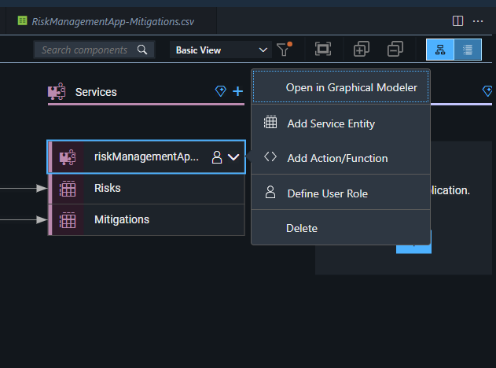
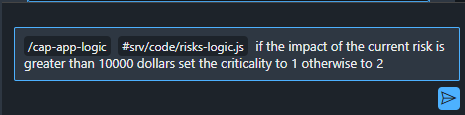

# Exercise 3 - Add Application Logic

In this exercise, lets create a logic for the service with the help of Joule. We have our risks and mitigation as our entities, lets create a logic where if the impact of risk is greather than 10000, set the criticality of that risk to high or set it to warning.

1. Go to your storyboard, under the services, open the graphical modeller, choose the risk entity and select add logic.



<br>

2. Once the dialog box appears, select the defaults.

<br>

3. Select the handlers as shown below

<br>

4. Open code editor, select application logic

<br>

5. Enter the below prompt in Joule 
```
if the impact of the current risk is greater than 10000 dollars set the criticality to 1 otherwise to 2
```


6. You can now review & accept the suggested code and the new changes will be reflected in your project.

<br>

7. code is as follows :
```javascript
/**
 * 
 * @After(event = { "READ" }, entity = "techedda181demoSrv.Risks")
 * @param {(Object|Object[])} results - For the After phase only: the results of the event processing
 * @param {Object} request - User information, tenant-specific CDS model, headers and query parameters
*/
module.exports = async function(results, request) {
    if (!results) return;

    const { Risks } = cds.entities;

    // Ensure results is an array
    if (!Array.isArray(results)) {
        results = [results];
    }

    for (const risk of results) {
        if (risk.impact !== undefined) {
            risk.criticality = risk.impact > 10000 ? 1 : 2;
        }
    }
};
```

## Summary

You've now added a service logic to your risk management application.

Continue to  [Exercise 4 - Add Business Partner Data ](../ex4/README.md) only if you have an existing S/4 system. if not skip Exercise 4 and go to  [Exercise 4.1 - Add Business Partner Service](../ex4/ex4.1/README.md) where you can mock the S/4 Cloud - Business Partner data and consume it in your application.

