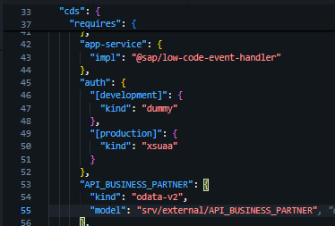
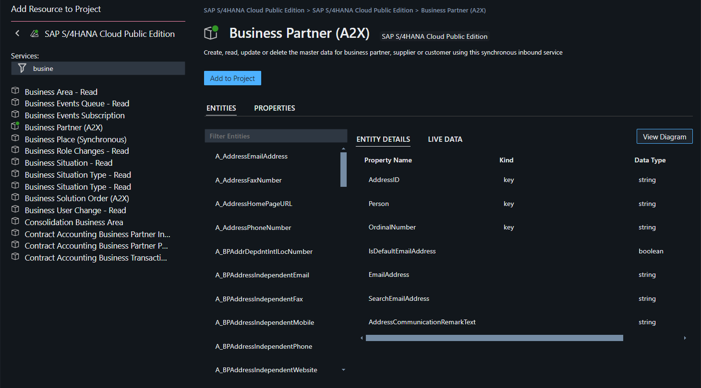
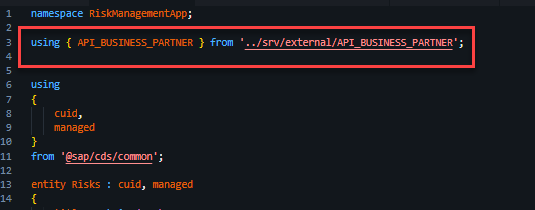
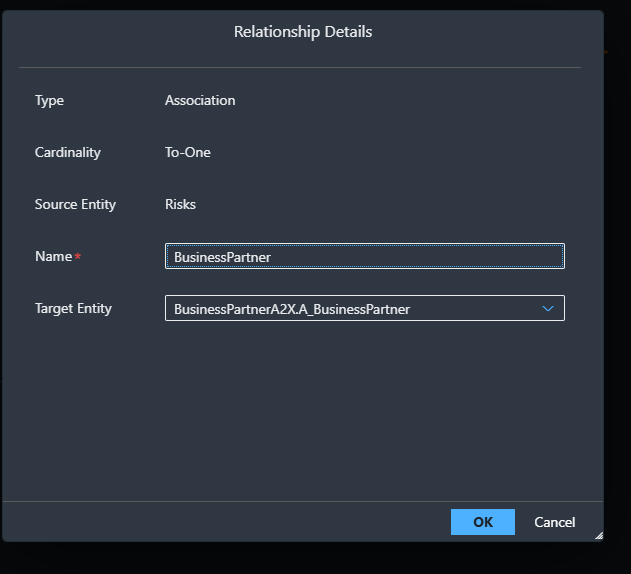

# Exercise 4 - Adding Business Partner Service

In this exercise, you will extend your CAP service with the consumption of an external Business Partner service from [SAP Business Accelerator Hub](https://api.sap.com/).

# Add Business Partner to your Project Storyboard

1. In Project Explorer > Storyboard, Click on '+' on External Resources.


2. Select Service, Under Select a provider - choose SAP SAP Business Accerlator Hub & Select a product- SAP S/4 HANA Cloud Public Edition. Click on SAP S/4 HANA Cloud Public Edition.  


3. Search for Business Partner(A2X), on click of it, you need enter your SAP Business Accerlator Hub Login credentials. 



4. Once you have entered the credentials, you will be able to add the Business Partner into your project by clicking on 'Add to Project'



5. Your project story board will look as shown below:



# Edit the Data Model & Service Definition with Business Partner

1. Open the Graphical Modeller


2.  Click on the risks entity and click on Add relationship and click on an empty space.


3. Once the dialog box opens, look for the target entity shown in the image below and rename the a_BusinessPartner to BusinessPartner.



4. Now the data model would look as follows :


5. Open the graphical modeller under service definition, click on the risks entity, and click Add entity. 


6. Under Projection, choose 'BusinessPartnerA2X.A_BusinessPartner'


7. Uncheck all properties, and choose only BusinessPartner, FirstName and LastName and save.


8. Graphical Model & Storyboard will look as follows: 


# Exercise 4.2 Connect your application to the Business Partner API Sandbox Enviroment

1. Import the API_BUSINESS_PARTNER from [SAP Business Accerlator Hub](https://api.sap.com/) and login with your credentials.

<br>

2. Navigate to the Business Partner API (SAP S/4HANA Cloud → Business Partner (A2X)).In the upper-right corner, choose Show API Key to see your API key. This is needed in the later part of the exercise

<br>

3. Download the EDMX file from the business partner and add it to the main folder.


4. Import the Business Partner file by running the below cds command in the terminal.

```cds

$ cds import API_BUSINESS_PARTNER.edmx

```
5. The API_BUSINESS_PARTNER.edmx has been imported to the folder srv/external, also it generates API_BUSINESS_PARTNER.csn file. This CSN file used by the CDS framework.


6. The package.json file is now updated in the requires section with the external service.

7. Update the schema.cds to the code given below.

```
NOTE : Keep in the mind, code can differ from the ones generated via Joule. 
```

```cds

using { API_BUSINESS_PARTNER } from '../srv/external/API_BUSINESS_PARTNER';

using
{
    cuid,
    managed
}
from '@sap/cds/common';

entity Risks : cuid, managed
{
    title : String(100)
        @mandatory;
    description : String(500);
    impact : Integer;
    criticality : Integer;
    status : String(20);
    mitigations : Association to many Mitigations on mitigations.risk = $self;
    newProperty : String(100);
    BusinessPartner : Association to one API_BUSINESS_PARTNER.A_BusinessPartner;
}

annotate Risks with @assert.unique :
{
    title : [ title ],
};

entity Mitigations : cuid, managed
{
    title : String(100)
        @mandatory;
    description : String(500);
    counter : Integer;
    effectiveness : String(20);
    risk : Association to one Risks;
}

annotate Mitigations with @assert.unique :
{
    title : [ title ],
};

```
8. In order to read the entity, create a custom handler.

```cds 

const cds = require('@sap/cds');
module.exports = cds.service.impl(async function() {
    const bp = await cds.connect.to('API_BUSINESS_PARTNER');    
    this.on('READ', 'A_BusinessPartner', async req => {        
        return bp.run(req.query);       
    });
});

```

9. Add the URL of the sandbox by making the following changes in the package.json. Copy the API key which we accessed earlier and add it in the file.

<br>

```json

      "API_BUSINESS_PARTNER": {
          "kind": "odata-v2",
          "model": "srv/external/API_BUSINESS_PARTNER",
          "credentials": {
            "url": "https://sandbox.api.sap.com/s4hanacloud/sap/opu/odata/sap/API_BUSINESS_PARTNER/",
             "headers": {
                "APIKey": <API_KEY>
            }
          }
        },

```
You've now created a custom handler for your service. This time it called on for the READ event.

The handler is invoked when your BusinessPartner service is called for a READ, so whenever there’s a request for business partner data, this handler is called. It ensures the request for the business partner is directed to the external business partner service. Furthermore, you have added a where clause to the request, which selects only business partners where the first and last name is set.

## Summary

You have now successfully extended the CAP service with the consumption of an external Business Partner Service

Additionally if you want to try the same with S4 system, follow this - [ Add Business Partner Data ](exercises/ex_optional/README.md)

Continue to -[Add UI to your application](../../ex5/README.md)

