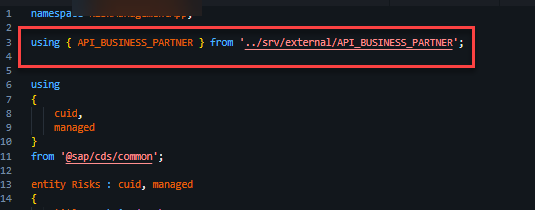
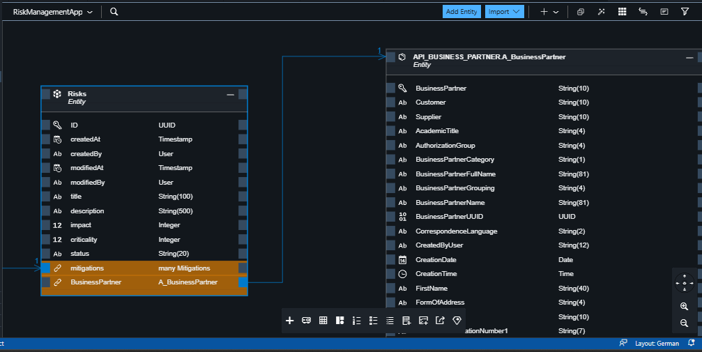
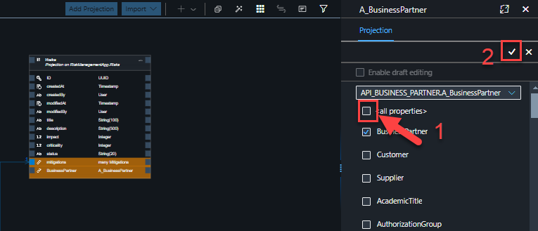

# Exercise 4 - Adding Business Partner Service

In this exercise, you will extend your CAP service with the consumption of an external Business Partner service from [SAP Business Accelerator Hub](https://api.sap.com/).

 ## Exercise 4.1 Connect your application to the Business Partner API Sandbox Enviroment

1. In order to import the API_BUSINESS_PARTNER from [SAP Business Accerlator Hub](https://api.sap.com/) lets begin with loging in with your credentials.

<br>

2. Once you have logged in, navigate to the Business Partner API (SAP S/4HANA Cloud → Business Partner (A2X)).


3. Scroll down to API Resources > API Specifications Download the EDMX file.


Once downloaded, upload the .edmx file to root folder of your project.


4. Import the Business Partner file by running the below cds command in the terminal. Click on the icon as shown below, select terminal > new terminal

<br>
```cds

cds import API_BUSINESS_PARTNER.edmx

```
5. The API_BUSINESS_PARTNER.edmx has been imported to the folder srv/external, also it generates API_BUSINESS_PARTNER.csn file. This CSN file is used by the CDS framework.


6. The package.json file is now updated in the requires section with the external service.


7. Add the below line in schema.cds and service.cds

```cds 
using { API_BUSINESS_PARTNER } from '../srv/external/API_BUSINESS_PARTNER';

```
Updated schema.cds will be as follows :




## Edit the Data Model & Service Definition with Business Partner

1. Open the Graphical Modeller under the data models as shown below and open the graphical modeller.


2.  Click on the risks entity and click on Add relationship and click on an empty space.


3. Once the dialog box opens, look for the target entity shown in the image below and rename the a_BusinessPartner to BusinessPartner.


4. Now the data model would look as follows :



5. Go back to your storyboard,  under service, select 'Add Service Entity' as shown below. 


6. Under Projection, choose 'API_BUSINESS_PARTNER.A_BusinessPartner'. Uncheck all properties, and choose only BusinessPartner, FirstName and LastName and save.

 

8. Graphical Model & Storyboard will look as follows: 


## Connect your application to the Business Partner API Sandbox Enviroment

In order to read the entity, create a custom handler. go to srv > service.js. Copy the below code

```cds 

const cds = require('@sap/cds');
module.exports = cds.service.impl(async function() {
    const bp = await cds.connect.to('API_BUSINESS_PARTNER');    
    this.on('READ', 'A_BusinessPartner', async req => {        
        return bp.run(req.query);       
    });
});

```

9. Add the URL of the sandbox by making the following changes in the package.json. Copy the API key which we accessed earlier and add it in the file.

<br>

```json

      "API_BUSINESS_PARTNER": {
          "kind": "odata-v2",
          "model": "srv/external/API_BUSINESS_PARTNER",
          "credentials": {
            "url": "https://sandbox.api.sap.com/s4hanacloud/sap/opu/odata/sap/API_BUSINESS_PARTNER/",
             "headers": {
                "APIKey": <API_KEY>
            }
          }
        },

```
You've now created a custom handler for your service. This time it called on for the READ event.

The handler is invoked when your BusinessPartner service is called for a READ, so whenever there’s a request for business partner data, this handler is called. It ensures the request for the business partner is directed to the external business partner service. Furthermore, you have added a where clause to the request, which selects only business partners where the first and last name is set.

## Summary

You have now successfully extended the CAP service with the consumption of an external Business Partner Service

Additionally if you want to try the same with S4 system, follow this - [ Add Business Partner Data ](exercises/ex_optional/README.md)


