# Exercise 4.1 - Adding Business Partner Service

In this exercise, you will extend your CAP service with the consumption of an external Business Partner service.

# Add Business Partner to your Project Storyboard

1. In Project Explorer > Storyboard, Click on '+' on External Resources.

    <br>

2. Select Service, Under Select a provider - choose SAP SAP Business Accerlator Hub & Select a product- SAP S/4 HANA Cloud Public Edition. Click on SAP S/4 HANA Cloud Public Edition.  

    <br>

3. Search for Business Partner(A2X), on click of it, you need enter your SAP Business Accerlator Hub Login credentials. 

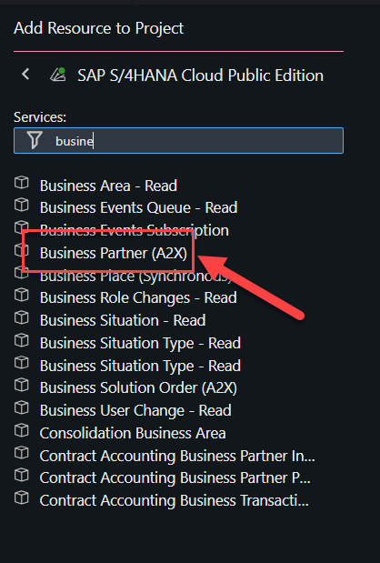

4. Once you have entered the credentials, you will be able to add the Business Partner into your project by clicking on 'Add to Project'

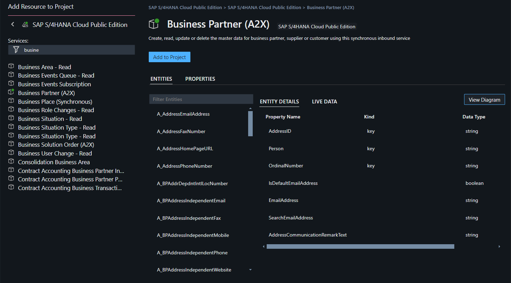

5. Your project story board will look as shown below:

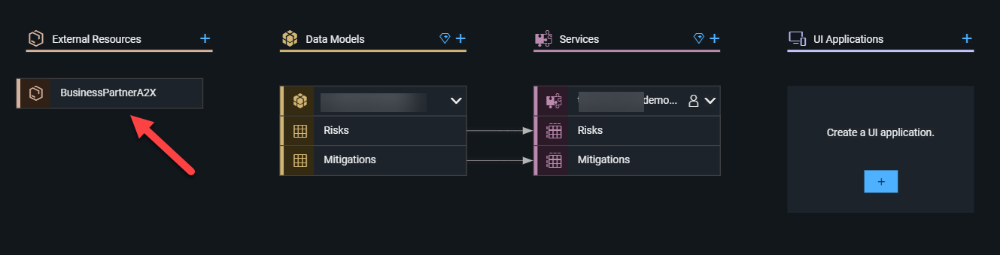

# Edit the Data Model & Service Definition with Business Partner

1. Open the Graphical Modeller

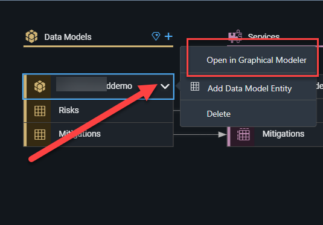

2.  Click on the risks entity and click on Add relationship and click on an empty space.
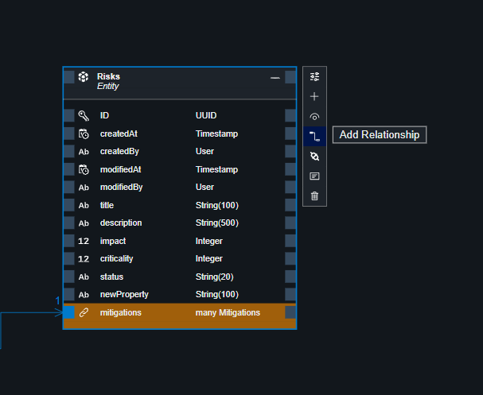


3. Once the dialog box opens, look for the target entity shown in the image below and rename the a_BusinessPartner to BusinessPartner.

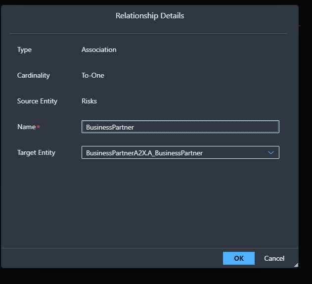

4. Now the data model would look as follows :

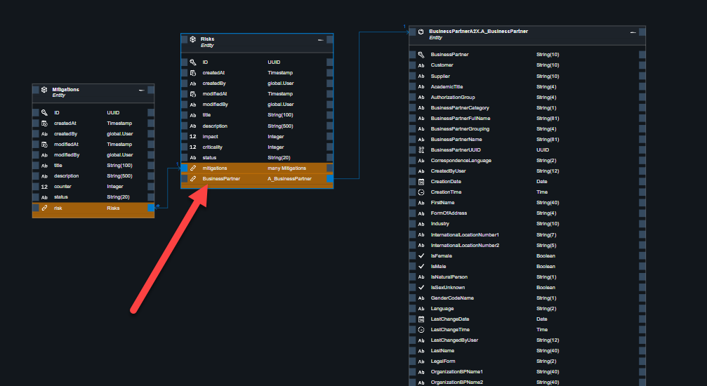

5. Open the graphical modeller under service definition, click on the risks entity, and click Add entity. 
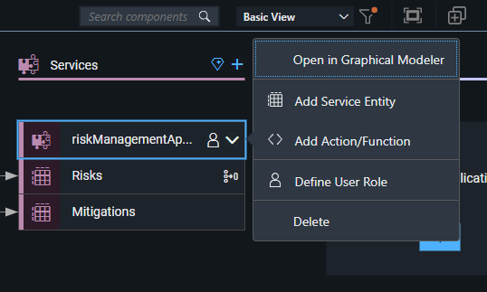


6. Under Projection, choose 'BusinessPartnerA2X.A_BusinessPartner'

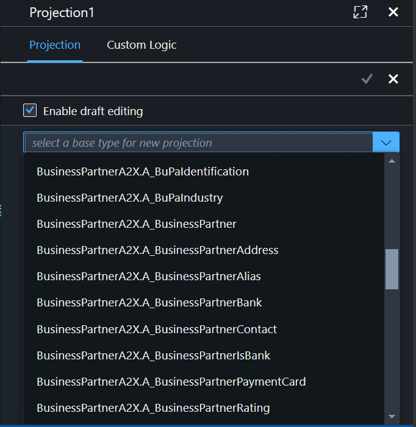

7. Uncheck all properties, and choose only BusinessPartner, FirstName and LastName and save.

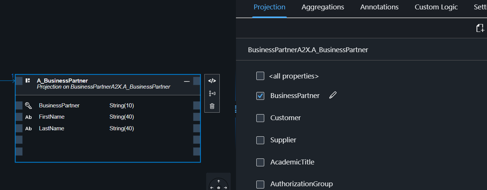


8. Graphical Model & Storyboard will look as follows: 


````
NOTE: Step 9 & 10 are optional, and can be used as a reference point to compare the code snippets. In case you are using the below code, make sure to replace the namespace to your project name.  
````

9. In your project soruce code  db/schema.cds section, compare the code to the one below.

````
NOTE: Make sure to check the namespace of your project. You will have to replace it with your own namespace of your project.  
````

```cds
//namespace techedda181demo;

using { BusinessPartnerA2X } from '../srv/external/BusinessPartnerA2X.cds';

using
{
    cuid,
    managed
}
from '@sap/cds/common';

entity Risks : cuid, managed
{
    title : String(100)
        @mandatory;
    description : String(500);
    impact : Integer;
    criticality : Integer;
    status : String(20);
    mitigations : Association to many Mitigations on mitigations.risk = $self;
    BusinessPartner : Association to one BusinessPartnerA2X.A_BusinessPartner;
}

annotate Risks with @assert.unique :
{
    title : [ title ],
};

entity Mitigations : cuid, managed
{
    title : String(100)
        @mandatory;
    description : String(500);
    counter : Integer;
    status : String(20);
    risk : Association to one Risks;
}

annotate Mitigations with @assert.unique :
{
    title : [ title ],
};


```

10. Replace the code snippet of srv/service.cds to the below given code. With this code you can now create a projection of your new service.Of the many entities and properties in these entities that are defined in the API_BUSINESS_PARTNER service, you just look at one of the entities (A_BusinessPartner) and just three of its properties - BusinessPartner, LastName, and FirstName - so that your projection is using a subset of everything the original service has to offer.

```cds
using { BusinessPartnerA2X } from './external/BusinessPartnerA2X.cds';

using { techedda181demo as my } from '../db/schema.cds';

@path : '/service/techedda181demo'
service techedda181demoSrv
{
    @odata.draft.enabled
    entity Risks as
        projection on my.Risks;

    @odata.draft.enabled
    entity Mitigations as
        projection on my.Mitigations;

    entity A_BusinessPartner as
        projection on BusinessPartnerA2X.A_BusinessPartner
        {
            BusinessPartner,
            FirstName,
            LastName
        };
}

annotate techedda181demoSrv with @requires :
[
    'authenticated-user'
];
```

```
NOTE : Please cross check on the name of the service and the entities
```

# Exercise 4.2 Connect your application to the Business Partner API Sandbox Enviroment

Now you have a new service exposed with a definition based on the imported CDS file. However, the CDS file only contains the schema and not the connectivity to the backend, so there is no data yet. In this case, you do not create local data as with your risks and mitigations entities, but you connect your service to the Sandbox environment of the SAP Business Accelerator Hub for the Business Partner API that you want to use. To use the API Business Hub Sandbox APIs, you require an API key. This key will authenticate your application with the API endpoint.

1. Go to the [SAP Business Accerlator Hub](https://api.sap.com/) and make sure you are logged in.

<br>

2. Navigate to the Business Partner API (SAP S/4HANA Cloud → Business Partner (A2X)).In the upper-right corner, choose Show API Key to see your API key.

<br>

3. Copy the API key

<br>

4. Go to your project source code in the SAP Build Code and add the below and replace the <YOUR-API-KEY> with the api key copied from the SAP Business Accerlator Hub. Your project > env > env2

```
apikey=<YOUR-API-KEY>
```
You are going to use the API key to call the Business Partner API of the sandbox system provided through the SAP Business Accelerator Hub.
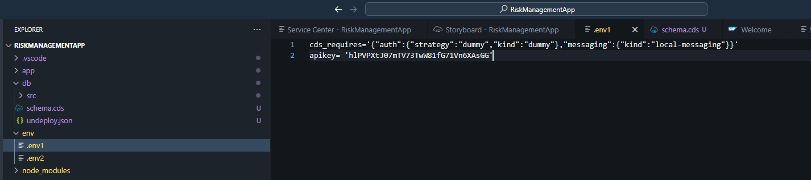

5. Open the package.json file and add the credentials configuration to the BusinessPartnerA2X configuration.

```json

"credentials": {
          "url": "https://sandbox.api.sap.com/s4hanacloud/sap/opu/odata/sap/API_BUSINESS_PARTNER/"
        }

```

6. It should look like the following 

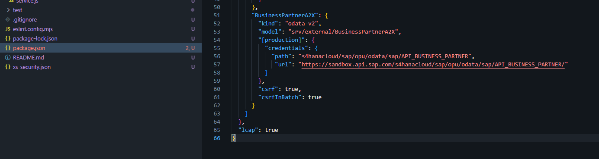

7. Open service.js and replace the following.

```javascript
const LCAPApplicationService = require('@sap/low-code-event-handler');
const risks_Logic = require('./code/risks-logic');

class techedreviseddemoSrv extends LCAPApplicationService {
   async init() {

       this.after('READ', 'Risks', async (results, request) => {
           await risks_Logic(results, request);
       });

       // connect to remote service
       const BPsrv = await cds.connect.to("BusinessPartnerA2X");
       const { A_BusinessPartner } = this.entities;
       /**
    * Event-handler for read-events on the BusinessPartners entity.
    * Each request to the API Business Hub requires the apikey in the header.
    */
       this.on("READ", A_BusinessPartner, async (req) => {
           // The API Sandbox returns alot of business partners with empty names.
           // We don't want them in our application
           req.query.where("LastName <> '' and FirstName <> '' ");

           return await BPsrv.transaction(req).send({
               query: req.query,
               headers: {
                   apikey: process.env.apikey, // /home/user/projects/techedreviseddemo/env/.env1
               },
           });
       });

       return super.init();
   }
}

module.exports = {
    techedreviseddemoSrv
};
```

```
NOTE : Replace the techedreviseddemoSrv to your project srv name
```


You've now created a custom handler for your service. This time it called on for the READ event.

The handler is invoked when your BusinessPartner service is called for a READ, so whenever there’s a request for business partner data, this handler is called. It ensures the request for the business partner is directed to the external business partner service. Furthermore, you have added a where clause to the request, which selects only business partners where the first and last name is set.

## Summary

You have now successfully extended the CAP service with the consumption of an external Business Partner Service

Continue to -[Add UI to your application](../../ex5/README.md)

