# Exercise 6 - Bind your application to an HDI Container & View the data in SAP HANA Database Explorer

In this exercise, we will create a [SAP HANA Deployment Infrastructure ( HDI ) container](https://help.sap.com/docs/SAP_HANA_PLATFORM/3823b0f33420468ba5f1cf7f59bd6bd9/3ef0ee9da11440e4b01708455b8497a9.html) and bind that container to our project and deploy the project to SAP HANA Cloud.

Pre-requisite : 
1. Set up [SAP HANA Cloud Instance](https://developers.sap.com/group.hana-cloud-get-started-1-trial.html) before proceeding with this exercise.
2. Login to Cloud Foundry and add your subaccount & space.

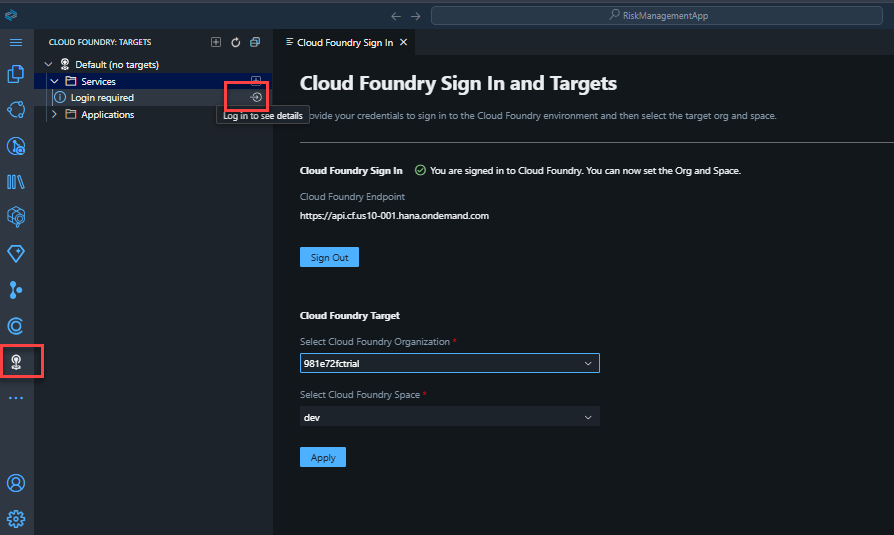

1. Go to Project Explorer, Click on Terminal. Enter the below command to add mta and hana. You will now see the project in the left bottom pane under SAP HANA Projects.

```shell
cds add mta
cds add hana
```

<br>

2. Create a HDI container, Under SAP HANA Projects, click on the bind icon, select Bind to an HDI Container.

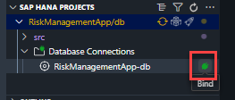

3. Click on [Create a new service instance]

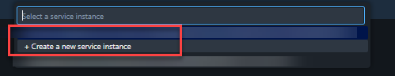

4. Enter the name of the HDI as per your choice or go ahead with the one generated and click enter.

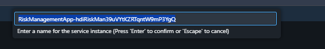

5. Click on Enable and do not ask again.

<br>


5. Now your HDI container service is created and is bound to your CAP project.

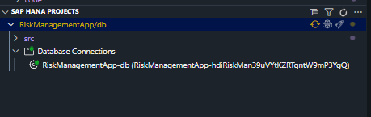

6. Open the Database Explorer by clicking on the cubical icon.

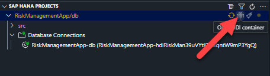

7. In the HDI container, you will see that the none of the artifacts are generated. Refer to the image below.

<br>

8. Go back to your SAP Build Code and deploy your project by clicking on the rocket icon, and this will deploy your project to your SAP HANA Cloud Instance

<br>

## Exercise 6.2  Go to SAP HANA Database explorer and check the tables

1. Click on database exploerer icon under SAP HANA Projects, which will open the SAP HANA Database explorer view. 

<br>

2. Generated artifacts are shown as below:

<br>

3. Sample data that was generated will not be seen in the below tables, as it will return empty.The data that was generated in step 2 is not on an production and is used for testing purpose only. In order to add the data, 

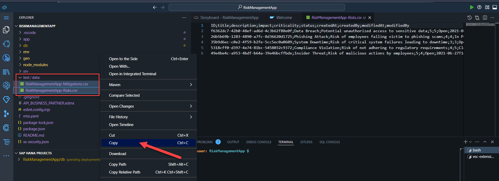

4. create a new folder called under db folder

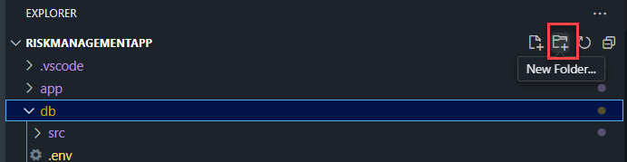

5. name the folder as 'data' as shown below.

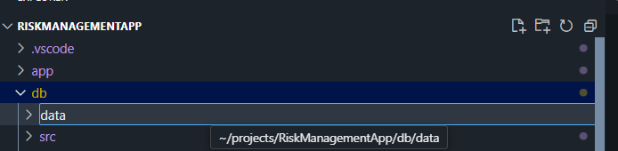

6. copy the csv files that is shown below.


7. paste the csv files in the newly created data folder ( db>data)

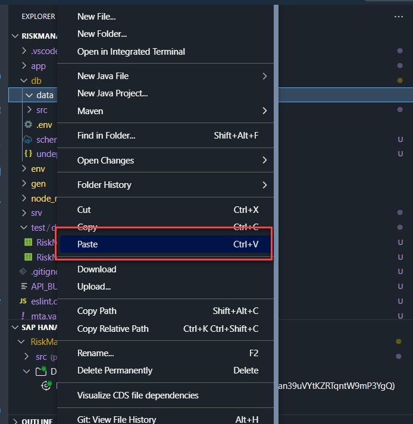

8. Your folder structure should look as follows

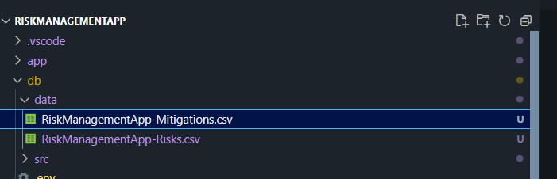

9. Data editor will also reflect the changes as follows for both risks and mitigations: sample data is used for testing purposes only, and initial data is the data used for production.


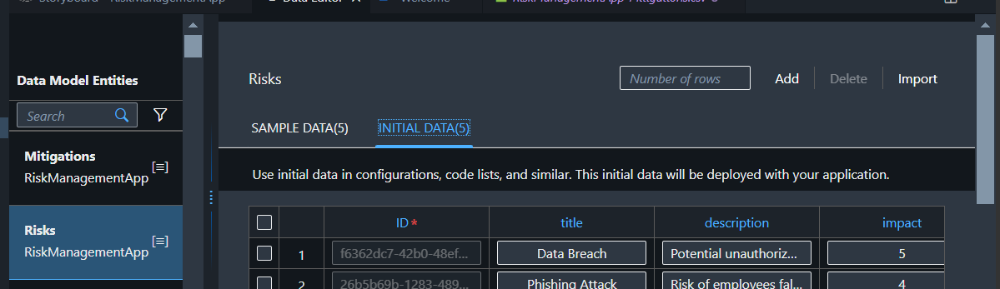

10. Deploy the application

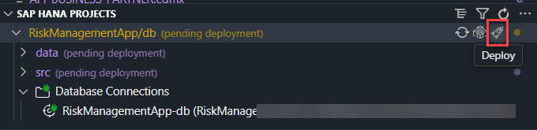

11. Once deployed successfully, Navigate to SAP HANA Database explorer and review the data.

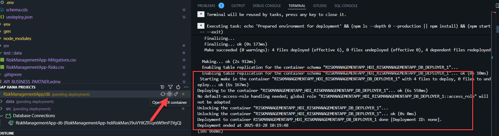

12. Review the tables and the data that is generated by the cds definitions and annotations.

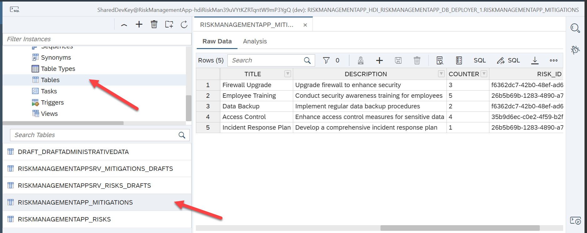


## Summary

You've now created a new HDI container and bound to your CAP Project. You can deploy the project to your SAP HANA Cloud instance and view the data in SAP HANA database explorer.

Continue to - [Exercise 7 - Run your application](../ex7/README.md)

