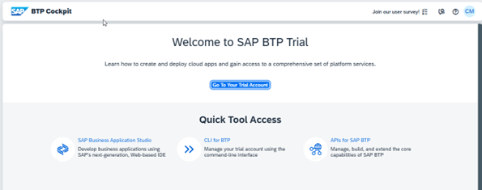

# Pre-requistes Check

## Must have pre-requisites

 __1.__ You have an SAP BTP Trial account [Get a Free Account on SAP BTP Trial](https://developers.sap.com/tutorials/hcp-create-trial-account.html)

 __2.__ You have to set up your [SAP HANA Cloud Instance](https://developers.sap.com/tutorials/hana-cloud-deploying.html) in the Cloud Foundry environment.
- The instance is started and status __"Running"__  

 __3.__ You have enabled and created a __"Cloud Foundry Environment"__
- You will require the __API Endpoint__ and __Org ID__
  

- Make sure you have created a __Cloud Foundry "Space"__ and as assigned the respective __space roles assigned to your user__.  

 __4.__ You have completed the [Setup SAP Build Code](https://developers.sap.com/tutorials/build-code-setup.html) tutorial.

 __5.__ Your SAP BTP Subaccount - Instances & Subscriptions should looks as follows:

 __6.__ You have an account in [SAP Business Accelerator Hub](https://api.sap.com/)

