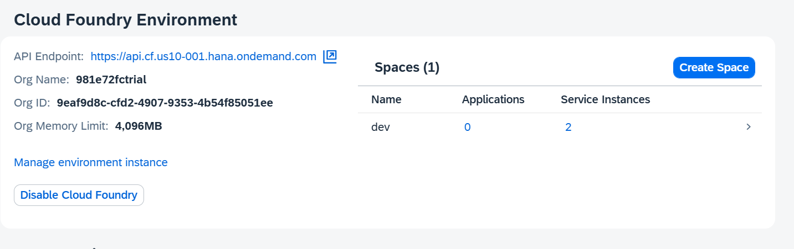

# Pre-requistes Check

## Must have pre-requisites

1. You have an SAP BTP Trial account [Get a Free Account on SAP BTP Trial](https://developers.sap.com/tutorials/hcp-create-trial-account.html)

2. You have completed the [Setup SAP Build Code](https://developers.sap.com/tutorials/build-code-setup.html) tutorial.

3. You have to set up [SAP HANA Cloud Instance](https://developers.sap.com/tutorials/hana-cloud-deploying.html) in Cloud Foundry enviroment.

4. You have the below space roles assigned to your user.

5. You have an account in [SAP Business Accelerator Hub](https://api.sap.com/)

6. Your SAP BTP Subaccount - Instances & Subscriptions should looks as follows:

